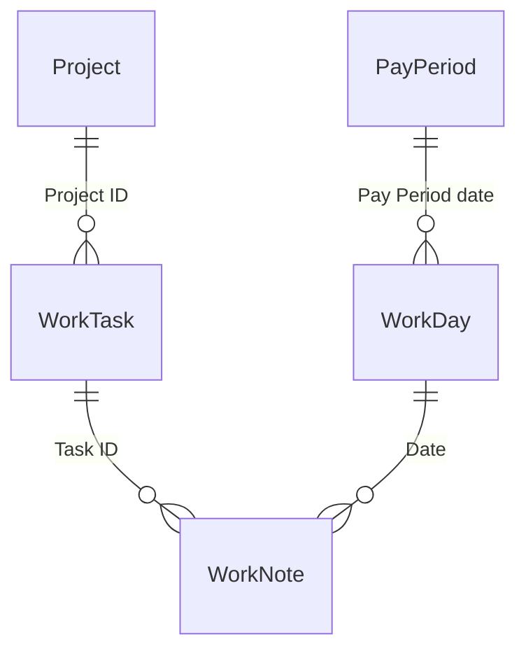

DailyNotes is a cloud-native productivity and knowledge management platform designed to replace a legacy FileMaker Pro work-tracking system.

### Key Relationships



---

## Solution Architecture

```
./
├── DailyNotes.slnx
├── src/
│   ├── DailyNotes.Api/           # .NET 10 Web API (thin controllers)
│   ├── DailyNotes.Api.Tests/     # xUnit integration tests
│   ├── DailyNotes.Application/   # Service interfaces + implementations, ITenantContext
│   ├── DailyNotes.Core/          # Entities, interfaces, DTOs (no dependencies)
│   ├── DailyNotes.Infrastructure/# EF Core, Postgres, provider stubs
│   ├── DailyNotes.Import/        # CSV import console tool
│   └── daily-notes-ui/           # React 19 + Vite + TypeScript SPA
├── docs/                         # Project documentation
├── scripts/                      # Helper scripts (init, build, run)
├── Dockerfile                    # Multi-stage build (API + UI)
├── docker-compose.yml            # Local dev: API + Postgres + UI
└── .github/workflows/ci.yml      # GitHub Actions CI/CD
```

**Dependency chain (no circular references):**

```
Core  ←  Infrastructure
Core  ←  Application  ←  Api
           ↑
     Infrastructure (via IDailyNotesDataContext)
```

`DailyNotes.Application` does **not** reference `DailyNotes.Infrastructure`. Instead it defines `IDailyNotesDataContext` (in `Application.Data`) which `DailyNotesDbContext` implements. This keeps the Application layer testable without the Infrastructure assembly.

---

## 1. Core Domain Layer

### [DailyNotes.Core](./src/DailyNotes.Core)

Class library containing entities, DTOs, and interfaces — no external dependencies.

**Entities** (C# PascalCase) mapped to the PostgreSQL schema:

| Entity | Key Fields |
|---|---|
| `Tenant` | Id, Name, CreatedAt |
| `TenantUser` | TenantId, UserId, Role (Owner/Member) |
| `Project` | Id, TenantId, UserId, **Visibility**, Name, Category, CreatedDate, CompletedDate |
| `WorkTask` | Id, TenantId, UserId, **Visibility**, ProjectId, Name, StartDate, DueDate, CompletedDate, ExternalSource, ExternalId |
| `WorkNote` | Id, TenantId, UserId, **Visibility**, WorkTaskId, NoteDate, Content (JSONB), TimeMinutes, ExternalSource, ExternalId |
| `WorkDay` | Id, TenantId, UserId, WorkDate, TimeIn1/Out1–3, BreakMinutes, Comments, HoursWorked (computed) |
| `PayPeriod` | Id, TenantId, UserId, PeriodStartDate, PeriodEndDate, Holidays, PtoReported |
| `SharedItem` | Id, ItemType, ItemId, SharedWithUserId, Permission |
| `Attachment` | Id, TenantId, UserId, ItemType, ItemId, FileName, ContentType, StoragePath, Source |
| `Topic` | Id, TenantId, UserId, **Visibility**, ParentTopicId, Title, Description, SkillLevel |
| `TopicNote` | Id, TenantId, UserId, **Visibility**, TopicId, Title, Content (JSONB), TimeMinutes |
| `Tag` | Id, TenantId, Name, Color |
| `ItemTag` | TagId, ItemType, ItemId (composite PK) |
| `Quiz` | Id, TenantId, TopicId, Title, Difficulty (1–5) |
| `QuizQuestion` | Id, QuizId, QuestionText, Explanation, SortOrder |
| `QuizOption` | Id, QuestionId, OptionText, IsCorrect, SortOrder |
| `QuizAttempt` | Id, QuizId, UserId, Score, StartedAt, CompletedAt |
| `QuizAnswer` | AttemptId, QuestionId, SelectedOptionId, IsCorrect (composite PK) |
| `Course` | Id, TenantId, UserId, Name, Instructor, Semester, Credits, ExternalSource, ExternalId, ProgressPercent, TopicId |
| `Assignment` | Id, CourseId, TenantId, UserId, Title, DueDate, Grade, Weight, Status |
| `MemoryItem` | Id, TenantId, UserId, MemoryType, MemoryStatus, Summary, Embedding (float[]), ImportanceScore, ConfidenceScore, AccessCount, CreatedAt, LastAccessedAt, LastConfirmedAt, RelatedMemoryId, SourceEntityType, SourceEntityId, SourceExcerpt |

**Interfaces:**

| Interface | Purpose |
|---|---|
| `IHasTenant` | Entities scoped to a tenant (`TenantId`) |
| `IHasTenantUser` | Extends `IHasTenant`; also scoped to a user (`UserId`) |
| `IAuthService` | Register / Login / RefreshToken |
| `IEmailProvider` | SendEmailAsync, SendEmailWithAttachmentAsync |
| `IFileStorageProvider` | UploadFileAsync, DownloadFileAsync, DeleteFileAsync |
| `IAiVisionProvider` | AnalyzeImageAsync, ExtractTextAsync |
| `ISpeechProvider` | TranscribeAudioAsync, SynthesizeSpeechAsync |

**Skill levels** (1–5): `Beginner` → `Novice` → `Intermediate` → `Advanced` → `Expert`

**Visibility** values: `private` (default) → `tenant` (all tenant members) → `custom` (specific users via `shared_items`)

**MemoryItem Trust Signals**

`ConfidenceScore` represents the system's confidence that a memory is accurate (0.0–1.0).

`LastConfirmedAt` records explicit human verification of a memory.

`ConfidenceScore` and `LastConfirmedAt` are intentionally separate. A memory may have high model confidence without user confirmation, or vice versa.

`SourceExcerpt` stores the specific text that produced the memory, allowing explainable recall and auditability.

`MemoryStatus` tracks the memory lifecycle: `Active`, `Superseded`, `Archived`, or `Incorrect`.

---

## 2. Infrastructure Layer

### [DailyNotes.Infrastructure](./src/DailyNotes.Infrastructure)

- **EF Core 10** with `Npgsql` provider
- `DailyNotesDbContext` with entity configurations (extends `IdentityDbContext`)
- **ASP.NET Core Identity** user/role tables stored in the same Postgres database
- Database migrations via `dotnet ef`

**Provider implementations:**

| Class | Interface | Status |
|---|---|---|
| `AuthService` | `IAuthService` | Implemented |
| `NullEmailProvider` | `IEmailProvider` | Stub — no-op |
| `NullFileStorageProvider` | `IFileStorageProvider` | Stub — no-op |
| `NullAiVisionProvider` | `IAiVisionProvider` | Stub — no-op |
| `NullSpeechProvider` | `ISpeechProvider` | Stub — no-op |

Replace stubs with real implementations (Azure, SendGrid, etc.) by registering them in `Program.cs` without changing any service code.

**PostgreSQL Schema:**

```sql
-- Identity tables auto-created by EF Core Identity

CREATE TABLE tenants (
    id          SERIAL PRIMARY KEY,
    name        VARCHAR(255) NOT NULL,
    created_at  TIMESTAMPTZ NOT NULL DEFAULT NOW()
);

CREATE TABLE tenant_users (
    tenant_id   INT NOT NULL REFERENCES tenants(id),
    user_id     TEXT NOT NULL,  -- FK to asp_net_users.id
    role        VARCHAR(50) NOT NULL DEFAULT 'member',
    preferences JSONB DEFAULT '{}',
    created_at  TIMESTAMPTZ NOT NULL DEFAULT NOW(),
    PRIMARY KEY (tenant_id, user_id)
);

CREATE TABLE projects (
    id              SERIAL PRIMARY KEY,
    tenant_id       INT NOT NULL REFERENCES tenants(id),
    user_id         TEXT NOT NULL,
    visibility      VARCHAR(20) NOT NULL DEFAULT 'private',
    name            VARCHAR(255) NOT NULL,
    category        VARCHAR(100),
    created_date    DATE,
    completed_date  DATE,
    created_at      TIMESTAMPTZ NOT NULL DEFAULT NOW(),
    updated_at      TIMESTAMPTZ NOT NULL DEFAULT NOW()
);
CREATE INDEX ix_projects_tenant_id ON projects(tenant_id);

-- work_tasks and work_notes follow same pattern with visibility column
-- work_tasks and work_notes also include:
--   external_source VARCHAR(50),  -- 'jira' | 'salesforce' | 'gitlab' | etc.
--   external_id    VARCHAR(255),
--   is_pinned      BOOLEAN NOT NULL DEFAULT FALSE

CREATE TABLE integration_connections (
    id              SERIAL PRIMARY KEY,
    tenant_id       INT NOT NULL REFERENCES tenants(id),
    provider        VARCHAR(50) NOT NULL,
    base_url        VARCHAR(500),
    encrypted_credentials TEXT,
    is_active       BOOLEAN NOT NULL DEFAULT TRUE,
    created_at      TIMESTAMPTZ NOT NULL DEFAULT NOW(),
    updated_at      TIMESTAMPTZ NOT NULL DEFAULT NOW(),
    CONSTRAINT uq_integration_tenant_provider UNIQUE (tenant_id, provider)
);

CREATE TABLE webhook_events (
    id              SERIAL PRIMARY KEY,
    tenant_id       INT NOT NULL REFERENCES tenants(id),
    provider        VARCHAR(50) NOT NULL,
    event_type      VARCHAR(100) NOT NULL,
    payload         JSONB NOT NULL,
    processed       BOOLEAN NOT NULL DEFAULT FALSE,
    created_at      TIMESTAMPTZ NOT NULL DEFAULT NOW()
);

CREATE TABLE api_keys (
    id              SERIAL PRIMARY KEY,
    tenant_id       INT NOT NULL REFERENCES tenants(id),
    user_id         TEXT NOT NULL,
    name            VARCHAR(255) NOT NULL,
    key_hash        TEXT NOT NULL,
    scopes          TEXT[] NOT NULL,
    is_active       BOOLEAN NOT NULL DEFAULT TRUE,
    last_used_at    TIMESTAMPTZ,
    created_at      TIMESTAMPTZ NOT NULL DEFAULT NOW()
);

CREATE TABLE webhook_subscriptions (
    id              SERIAL PRIMARY KEY,
    tenant_id       INT NOT NULL REFERENCES tenants(id),
    url             TEXT NOT NULL,
    events          TEXT[] NOT NULL,
    secret          TEXT NOT NULL,
    is_active       BOOLEAN NOT NULL DEFAULT TRUE,
    created_at      TIMESTAMPTZ NOT NULL DEFAULT NOW()
);

CREATE TABLE shared_items (
    id                  SERIAL PRIMARY KEY,
    item_type           VARCHAR(50) NOT NULL,
    item_id             INT NOT NULL,
    shared_with_user_id TEXT NOT NULL,
    permission          VARCHAR(20) NOT NULL DEFAULT 'read',
    created_at          TIMESTAMPTZ NOT NULL DEFAULT NOW()
);
CREATE INDEX ix_shared_items_lookup ON shared_items(item_type, item_id);
CREATE INDEX ix_shared_items_user ON shared_items(shared_with_user_id);

CREATE TABLE attachments (
    id              SERIAL PRIMARY KEY,
    tenant_id       INT NOT NULL REFERENCES tenants(id),
    user_id         TEXT NOT NULL,
    item_type       VARCHAR(50) NOT NULL,
    item_id         INT NOT NULL,
    file_name       VARCHAR(500) NOT NULL,
    content_type    VARCHAR(100) NOT NULL,
    storage_path    TEXT NOT NULL,
    file_size_bytes BIGINT,
    source          VARCHAR(50) NOT NULL DEFAULT 'upload',
    external_url    TEXT,
    ocr_text        TEXT,
    transcription   TEXT,
    duration_seconds INT,
    created_at      TIMESTAMPTZ NOT NULL DEFAULT NOW()
);
CREATE INDEX ix_attachments_item ON attachments(item_type, item_id);

-- Full-text search vectors (target state — not yet applied via migration)
ALTER TABLE work_notes ADD COLUMN search_vector tsvector
  GENERATED ALWAYS AS (to_tsvector('english', coalesce(content::text, ''))) STORED;
ALTER TABLE work_tasks ADD COLUMN search_vector tsvector
  GENERATED ALWAYS AS (to_tsvector('english', coalesce(name, ''))) STORED;
ALTER TABLE topics ADD COLUMN search_vector tsvector
  GENERATED ALWAYS AS (to_tsvector('english', coalesce(title, '') || ' ' || coalesce(description, ''))) STORED;
ALTER TABLE topic_notes ADD COLUMN search_vector tsvector
  GENERATED ALWAYS AS (to_tsvector('english', coalesce(title, '') || ' ' || coalesce(content::text, ''))) STORED;

CREATE INDEX ix_work_notes_search ON work_notes USING GIN(search_vector);
CREATE INDEX ix_work_tasks_search ON work_tasks USING GIN(search_vector);
CREATE INDEX ix_topics_search ON topics USING GIN(search_vector);
CREATE INDEX ix_topic_notes_search ON topic_notes USING GIN(search_vector);

CREATE TABLE tags (
    id          SERIAL PRIMARY KEY,
    tenant_id   INT NOT NULL REFERENCES tenants(id),
    name        VARCHAR(100) NOT NULL,
    color       VARCHAR(20),
    CONSTRAINT uq_tags_tenant_name UNIQUE (tenant_id, name)
);

CREATE TABLE topics (
    id                  SERIAL PRIMARY KEY,
    tenant_id           INT NOT NULL REFERENCES tenants(id),
    user_id             TEXT NOT NULL,
    visibility          VARCHAR(20) NOT NULL DEFAULT 'private',
    parent_topic_id     INT REFERENCES topics(id) ON DELETE SET NULL,
    title               VARCHAR(255) NOT NULL,
    description         TEXT,
    proficiency         VARCHAR(20) DEFAULT 'learning',
    skill_level         SMALLINT NOT NULL DEFAULT 1,
    is_pinned           BOOLEAN NOT NULL DEFAULT FALSE,
    created_at          TIMESTAMPTZ NOT NULL DEFAULT NOW(),
    updated_at          TIMESTAMPTZ NOT NULL DEFAULT NOW()
);
CREATE INDEX ix_topics_tenant_id ON topics(tenant_id);
CREATE INDEX ix_topics_parent ON topics(parent_topic_id);

CREATE TABLE topic_notes (
    id              SERIAL PRIMARY KEY,
    tenant_id       INT NOT NULL REFERENCES tenants(id),
    user_id         TEXT NOT NULL,
    visibility      VARCHAR(20) NOT NULL DEFAULT 'private',
    topic_id        INT NOT NULL REFERENCES topics(id),
    title           VARCHAR(255),
    content         JSONB,
    time_minutes    INT DEFAULT 0,
    created_at      TIMESTAMPTZ NOT NULL DEFAULT NOW(),
    updated_at      TIMESTAMPTZ NOT NULL DEFAULT NOW()
);
CREATE INDEX ix_topic_notes_topic_id ON topic_notes(topic_id);

CREATE TABLE item_tags (
    tag_id      INT NOT NULL REFERENCES tags(id) ON DELETE CASCADE,
    item_type   VARCHAR(50) NOT NULL,
    item_id     INT NOT NULL,
    tenant_id   INT NOT NULL REFERENCES tenants(id),
    PRIMARY KEY (tag_id, item_type, item_id)
);
CREATE INDEX ix_item_tags_lookup ON item_tags(item_type, item_id);

CREATE TABLE quizzes (
    id          SERIAL PRIMARY KEY,
    tenant_id   INT NOT NULL REFERENCES tenants(id),
    topic_id    INT NOT NULL REFERENCES topics(id),
    title       VARCHAR(255) NOT NULL,
    difficulty  SMALLINT NOT NULL DEFAULT 1,
    created_at  TIMESTAMPTZ NOT NULL DEFAULT NOW()
);

CREATE TABLE quiz_questions (
    id              SERIAL PRIMARY KEY,
    quiz_id         INT NOT NULL REFERENCES quizzes(id) ON DELETE CASCADE,
    question_text   TEXT NOT NULL,
    explanation     TEXT,
    sort_order      INT NOT NULL DEFAULT 0
);

CREATE TABLE quiz_options (
    id              SERIAL PRIMARY KEY,
    question_id     INT NOT NULL REFERENCES quiz_questions(id) ON DELETE CASCADE,
    option_text     TEXT NOT NULL,
    is_correct      BOOLEAN NOT NULL DEFAULT FALSE,
    sort_order      INT NOT NULL DEFAULT 0
);

CREATE TABLE quiz_attempts (
    id              SERIAL PRIMARY KEY,
    quiz_id         INT NOT NULL REFERENCES quizzes(id),
    user_id         TEXT NOT NULL,
    score           DECIMAL(5,2),
    started_at      TIMESTAMPTZ NOT NULL DEFAULT NOW(),
    completed_at    TIMESTAMPTZ
);

CREATE TABLE quiz_answers (
    attempt_id          INT NOT NULL REFERENCES quiz_attempts(id) ON DELETE CASCADE,
    question_id         INT NOT NULL REFERENCES quiz_questions(id),
    selected_option_id  INT REFERENCES quiz_options(id),
    is_correct          BOOLEAN NOT NULL,
    PRIMARY KEY (attempt_id, question_id)
);

CREATE TABLE courses (
    id              SERIAL PRIMARY KEY,
    tenant_id       INT NOT NULL REFERENCES tenants(id),
    user_id         TEXT NOT NULL,
    name            VARCHAR(255) NOT NULL,
    instructor      VARCHAR(255),
    semester        VARCHAR(50),
    credits         SMALLINT,
    current_grade   DECIMAL(5,2),
    external_source VARCHAR(50),
    external_id     VARCHAR(255),
    external_url    TEXT,
    progress_percent SMALLINT DEFAULT 0,
    topic_id        INT REFERENCES topics(id),
    is_pinned       BOOLEAN NOT NULL DEFAULT FALSE,
    created_at      TIMESTAMPTZ NOT NULL DEFAULT NOW(),
    updated_at      TIMESTAMPTZ NOT NULL DEFAULT NOW()
);
CREATE INDEX ix_courses_tenant_id ON courses(tenant_id);

CREATE TABLE assignments (
    id              SERIAL PRIMARY KEY,
    course_id       INT NOT NULL REFERENCES courses(id),
    tenant_id       INT NOT NULL REFERENCES tenants(id),
    user_id         TEXT NOT NULL,
    title           VARCHAR(255) NOT NULL,
    description     TEXT,
    due_date        TIMESTAMPTZ,
    grade           DECIMAL(5,2),
    max_grade       DECIMAL(5,2) DEFAULT 100,
    weight          DECIMAL(5,2),
    status          VARCHAR(20) NOT NULL DEFAULT 'pending',
    topic_id        INT REFERENCES topics(id),
    created_at      TIMESTAMPTZ NOT NULL DEFAULT NOW(),
    updated_at      TIMESTAMPTZ NOT NULL DEFAULT NOW()
);
CREATE INDEX ix_assignments_course_id ON assignments(course_id);

CREATE TABLE memory_items (
    id              SERIAL PRIMARY KEY,
    tenant_id       INT NOT NULL REFERENCES tenants(id),
    user_id         TEXT NOT NULL,
    memory_type     VARCHAR(50) NOT NULL,
    memory_status   VARCHAR(50) NOT NULL DEFAULT 'Active',
    summary         TEXT NOT NULL,
    embedding       vector(1536) NOT NULL,
    importance_score DOUBLE PRECISION NOT NULL,
    confidence_score DOUBLE PRECISION NOT NULL,
    access_count    INT NOT NULL DEFAULT 0,
    created_at      TIMESTAMPTZ NOT NULL DEFAULT NOW(),
    last_accessed_at TIMESTAMPTZ NOT NULL DEFAULT NOW(),
    last_confirmed_at TIMESTAMPTZ,
    related_memory_id INT REFERENCES memory_items(id) ON DELETE SET NULL,
    source_entity_type VARCHAR(50),
    source_entity_id   INT,
    source_excerpt  TEXT
);
CREATE INDEX ix_memory_items_tenant_id ON memory_items(tenant_id);
CREATE INDEX ix_memory_items_tenant_user ON memory_items(tenant_id, user_id);
```

---

## 3. Application Layer

### [DailyNotes.Application](./src/DailyNotes.Application)

Contains all use-case logic. Services inherit `ApplicationServiceBase` which provides:
- `IDailyNotesDataContext _db` — data access via interface (implemented by `DailyNotesDbContext` in Infrastructure)
- `ITenantContext _tc` — current user/tenant for the request
- `TimeProvider _clock` — injectable clock; use `_clock.GetUtcNow().UtcDateTime` instead of `DateTime.UtcNow`
- `TenantScoped<T>(query)` — adds `WHERE TenantId = x AND UserId = y` (for `IHasTenantUser` entities)
- `TenantOnlyScoped<T>(query)` — adds `WHERE TenantId = x` (for `IHasTenant` entities: `Tag`, `Quiz`)

**Service interfaces:**

| Interface | Domain |
|---|---|
| `IWorkDayService` | Work day CRUD + today lookup |
| `IWorkNoteService` | Work note CRUD; `CreateAsync` ensures the linked WorkDay exists (wrapped in transaction) |
| `IWorkTaskService` | Work task CRUD + overdue query |
| `IProjectService` | Project CRUD + project tasks query |
| `ICourseService` | Course CRUD (with Assignments include) |
| `ITopicService` | Topic CRUD + children + notes for topic |
| `ITopicNoteService` | Topic note CRUD + tag filtering |
| `ITagService` | Tag CRUD + polymorphic tag/untag operations |
| `IAssignmentService` | Assignment CRUD |
| `IAttachmentService` | Attachment CRUD (metadata only) |
| `IPayPeriodService` | Pay period CRUD + work days for period |
| `IQuizService` | Quiz CRUD + add question/option |
| `IQuizAttemptService` | Attempt history, detail, submit (scoring wrapped in transaction) |
| `ISearchService` | Cross-entity search (notes, tasks, topics) |

**`ITenantContext`** is defined here and implemented in the Api layer as `HttpTenantContext` (reads JWT claims via `IHttpContextAccessor`).

**Request DTOs** in `DailyNotes.Application.DTOs.Requests`:
- One `*Request` DTO per entity used for `POST` and `PUT` bodies (e.g., `WorkDayRequest`, `WorkNoteRequest`, `WorkTaskRequest`, etc.)
- Controllers accept request DTOs — never raw domain entities — so clients cannot supply `TenantId`, `UserId`, `CreatedAt`, or `Id` in the request body.

**Response/operation DTOs** in `DailyNotes.Application.DTOs`:
- `QuizDetailDto` — quiz + questions + options
- `QuizAttemptDetailDto` — attempt + answers
- `QuizSubmissionDto` / `QuizAnswerDto` — submit payload

**Exceptions** in `DailyNotes.Core.Exceptions`:
- `DomainException(message, statusCode)` — thrown by services for expected failures (e.g., invalid input, not found). The global exception handler maps these directly to the specified HTTP status code rather than 500.

---

## 4. API Layer

### [DailyNotes.Api](./src/DailyNotes.Api)

.NET 10 Web API with thin controllers. Each controller injects one service interface; action methods are typically 1–3 lines.

**`HttpTenantContext`** (`Api/Infrastructure/HttpTenantContext.cs`) — implements `ITenantContext` by reading `ClaimTypes.NameIdentifier` (or `sub`) and `tenant_id` claims from the JWT via `IHttpContextAccessor`. Registered as `Scoped`.

**`ApiControllerBase`** provides `CurrentUserId` and `CurrentTenantId` properties for the rare case a controller action needs direct claim access (e.g., `AuthController`).

**Endpoints:**

| Resource | Endpoints |
|---|---|
| **Auth** | `POST /api/auth/register`, `POST /api/auth/login`, `POST /api/auth/refresh`, `POST /api/auth/logout` |
| **WorkDays** | `GET /api/work-days?date=&from=&to=&all=`, `GET /api/work-days/today`, `GET /{id}`, `POST`, `PUT /{id}`, `DELETE /{id}` |
| **WorkNotes** | `GET /api/work-notes?date=&taskId=&page=&pageSize=`, `GET /{id}`, `POST`, `PUT /{id}`, `DELETE /{id}` |
| **WorkTasks** | `GET /api/work-tasks?status=&projectId=`, `GET /overdue`, `GET /{id}`, `POST`, `PUT /{id}`, `DELETE /{id}` |
| **Projects** | Full CRUD + `GET /{id}/tasks` |
| **Courses** | Full CRUD (`?semester=`) + includes Assignments on `GET /{id}` |
| **Assignments** | Full CRUD (`?courseId=&status=&dueDate=`) |
| **Topics** | Full CRUD (`?parentId=&all=`) + `GET /{id}/children` + `GET /{id}/notes` |
| **TopicNotes** | Full CRUD (`?topicId=&tagId=`) |
| **Tags** | Full CRUD + `POST /{tagId}/items`, `DELETE /{tagId}/items/{itemType}/{itemId}`, `GET /{tagId}/items` |
| **Attachments** | `GET /api/attachments?itemType=&itemId=`, `GET /{id}`, `POST`, `DELETE /{id}` |
| **PayPeriods** | Full CRUD (`?date=`) + `GET /{id}/work-days` |
| **Quizzes** | Full CRUD (`?topicId=&difficulty=`) + `POST /{quizId}/questions` + `POST /questions/{questionId}/options` |
| **QuizAttempts** | `GET /api/quiz-attempts?quizId=`, `GET /{id}`, `POST` (submit) |
| **MemoryItems** | Full CRUD + `POST /search` |
| **Search** | `GET /api/search?q=&type=&dateFrom=&dateTo=&projectId=&statuses=` |

All endpoints except `/api/auth/*` require `[Authorize]` with a valid JWT Bearer token.

**Cross-cutting configuration** (`Program.cs` + `Api/Extensions/ServiceCollectionExtensions.cs`):
- `AddInfrastructureServices` — DbContext, Identity, `IDailyNotesDataContext`, auth service, provider stubs, `TimeProvider.System`
- `AddApplicationServices` — all 14 service interface → implementation registrations
- `AddAuthConfiguration` — JWT Bearer validation parameters
- `AddSwaggerConfiguration` — OpenAPI doc + Bearer security scheme
- CORS for `localhost:5173` (Vite) and `localhost:4200`
- Rate limiting on auth endpoints (10 req/min)
- Global exception handler: `DomainException` → its `StatusCode`; all others → 500

---

## 5. Authentication Flow

```csharp
// ASP.NET Core Identity + JWT Bearer

builder.Services.AddIdentityCore<IdentityUser>()
    .AddEntityFrameworkStores<DailyNotesDbContext>();

builder.Services.AddAuthentication(JwtBearerDefaults.AuthenticationScheme)
    .AddJwtBearer(options => {
        options.TokenValidationParameters = new TokenValidationParameters {
            ValidateIssuer = true,   ValidIssuer   = config["Jwt:Issuer"],
            ValidateAudience = true, ValidAudience = config["Jwt:Audience"],
            ValidateIssuerSigningKey = true,
            IssuerSigningKey = new SymmetricSecurityKey(
                Encoding.UTF8.GetBytes(config["Jwt:Key"]!))
        };
    });

// FUTURE: Microsoft Entra ID migration
// 1. Install: Microsoft.Identity.Web
// 2. Replace with:
//    builder.Services.AddAuthentication(JwtBearerDefaults.AuthenticationScheme)
//        .AddMicrosoftIdentityWebApi(builder.Configuration.GetSection("AzureAd"));
// 3. appsettings.json: "AzureAd": { "TenantId": "...", "ClientId": "..." }
```

**Token claims:** `sub` (UserId), `email`, `jti`, `tenant_id`, `role`  
**Access token:** 1-hour JWT, HMAC-SHA256  
**Refresh token:** 64-byte random, stored in `asp_net_user_tokens` table, rotated on every refresh  
**Refresh cookie:** httpOnly, Secure (production), SameSite=Strict

---

## 6. React Frontend

### [daily-notes-ui](./src/daily-notes-ui)

React 19 SPA built with Vite, TypeScript, and Tailwind CSS 4.

| Layer | Library |
|---|---|
| Framework | React 19 + TypeScript |
| Build | Vite 7 |
| Routing | React Router 7 |
| Server state | TanStack Query 5 |
| Client state | Zustand 5 |
| Rich text editor | Lexical 0.41 (content stored as JSONB) |
| HTTP client | Axios (JWT interceptor + auto-refresh) |
| Styling | Tailwind CSS 4 |
| Icons | Lucide React |

**Core modules:** Dashboard, Work Days, Tasks, Projects, Notes, Knowledge Base (topics/quizzes), Education (courses/assignments), Global Search, Pay Periods.

---

## 7. Tests

### [DailyNotes.Api.Tests](./src/DailyNotes.Api.Tests)

Integration tests using `WebApplicationFactory<Program>` with an InMemory database.

- `CustomWebApplicationFactory` — swaps Postgres for InMemory DB; replaces JWT auth with `TestAuthHandler` that reads `X-User-Id` and `X-Tenant-Id` request headers as claims.
- 22 tests across 12 controller test classes.
- Run: `dotnet test`

---

## 8. Cross-Platform Development

The project includes a `.devcontainer/` configuration (VS Code Dev Container using .NET 10 image) and `scripts/` with both `.sh` and `.ps1` versions of `init`, `build`, and `run` scripts.

```powershell
# Start only the database
docker-compose up -d postgres

# Start full stack (API + Postgres)
docker-compose up -d

# Frontend dev server
npm install
npm run dev
```
