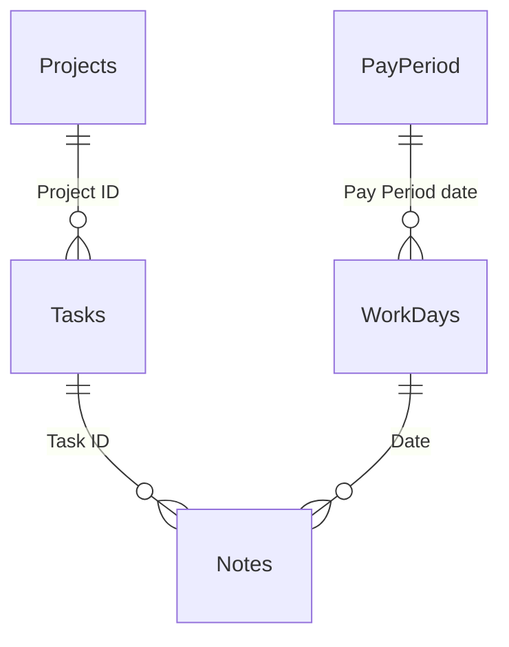

# DailyNotes: Migrate FileMaker to .NET 8 + Angular + Tailwind CSS + PostgreSQL

Migrate the existing **Work Days** FileMaker Pro database (7 tables, ~60K total records) to a modern full-stack application using **.NET 8 Web API**, **Angular + Tailwind CSS**, and **PostgreSQL**.

---

## Existing FileMaker Schema Summary

The DDR reveals a **daily work-tracking application** with time tracking, task/project management, notes, pay periods, and monthly goal tracking.

### Tables & Record Counts

| Table | Fields | Records | Purpose |
|---|---|---|---|
| **Work Days** | 27 | 5,853 | Daily time in/out (3 sessions), breaks, hours |
| **Tasks** | 25 | 509 | Task tracking with project linkage, status flags |
| **Notes** | 21 | 54,436 | Time entries per task per day (the core work log) |
| **Projects** | 8 | 27 | Project/client grouping for tasks |
| **Pay Period** | 13 | 554 | Semi-monthly pay period summaries |
| ~~Monthly Goals~~ | 11 | 0 | *Deferred* |
| ~~Monthly Goal Tasks~~ | 7 | 0 | *Deferred* |

### Key Relationships



---

## User Review Required

> [!NOTE]
> **Monthly Goals & Monthly Goal Tasks** — Deferred from initial scope (0 records, can be added later).

> [!NOTE]
> **Authentication** — ASP.NET Core Identity + JWT, with code-level documentation for migrating to Microsoft Entra ID.

> [!NOTE]
> **Data migration** — One-time CSV import tool to seed Postgres from exported FileMaker data.

---

## Proposed Solution Architecture

```
c:\HughApps\DailyNotes\
├── DailyNotes.sln
├── src/
│   ├── DailyNotes.Api/           # .NET 8 Web API
│   ├── DailyNotes.Core/          # Entities, interfaces, DTOs
│   ├── DailyNotes.Infrastructure/# EF Core, Postgres, cloud providers
│   ├── DailyNotes.Import/        # CSV import console tool
│   └── daily-notes-ui/           # React + Vite + TypeScript SPA
├── tests/
│   └── DailyNotes.Api.Tests/     # xUnit integration/unit tests
├── Dockerfile                    # Multi-stage build (API + UI)
├── docker-compose.yml            # Local dev: API + Postgres + UI
└── .github/workflows/ci.yml      # GitHub Actions CI/CD
```

---

## Proposed Changes

### 1. Core Domain Layer

#### [NEW] [DailyNotes.Core](file:///c:/HughApps/DailyNotes/src/DailyNotes.Core)

Class library containing entities, DTOs, and interfaces — no external dependencies.

**Entities** (C# PascalCase) mapped from FileMaker tables:

| Entity | Key Fields |
|---|---|
| `Tenant` | Id, Name, CreatedAt |
| `TenantUser` | TenantId, UserId, Role (Owner/Member) |
| `Project` | Id, TenantId, UserId, **Visibility**, Name, Category, CreatedDate, CompletedDate |
| `WorkTask` | Id, TenantId, UserId, **Visibility**, ProjectId, Name, StartDate, DueDate, CompletedDate, ExternalSource, ExternalId |
| `WorkNote` | Id, TenantId, UserId, **Visibility**, WorkTaskId, NoteDate, Content, TimeMinutes, ExternalSource, ExternalId |
| `WorkDay` | Id, TenantId, UserId, WorkDate, TimeIn1/Out1–3, BreakMinutes, Comments |
| `PayPeriod` | Id, TenantId, PeriodEndDate |
| `SharedItem` | Id, ItemType, ItemId, SharedWithUserId, Permission |
| `Attachment` | Id, TenantId, UserId, ItemType, ItemId, FileName, ContentType, StoragePath, Source |
| `Topic` | Id, TenantId, UserId, **Visibility**, ParentTopicId, Title, Description, SkillLevel |
| `TopicNote` | Id, TenantId, UserId, **Visibility**, TopicId, Title, Content, TimeMinutes |
| `TopicTag` | Id, TenantId, Name |
| `Quiz` | Id, TenantId, TopicId, Title, Difficulty (1–5) |
| `QuizQuestion` | Id, QuizId, QuestionText, Explanation |
| `QuizOption` | Id, QuestionId, OptionText, IsCorrect, SortOrder |
| `QuizAttempt` | Id, QuizId, UserId, Score, CompletedAt |
| `QuizAnswer` | AttemptId, QuestionId, SelectedOptionId, IsCorrect |
| `Course` | Id, TenantId, UserId, Name, Instructor, Semester, Credits, ExternalSource, ExternalId, ProgressPercent, TopicId |
| `Assignment` | Id, CourseId, TenantId, UserId, Title, DueDate, Grade, Weight |

**Skill levels** (1–5): `Beginner` → `Novice` → `Intermediate` → `Advanced` → `Expert`

**Visibility** enum: `Private` (default) → `Tenant` (all tenant members) → `Custom` (specific users via `shared_items`)

**Calculated properties** (formerly FileMaker calcs) become:
- C# computed properties on entities (e.g., `WorkDay.TotalMinutes`, `WorkDay.TotalHours`, `WorkTask.IsOverdue`)
- API-level aggregate queries (e.g., `WorkTask.TotalHours` = sum of related `WorkNote.TimeMinutes`)

**External integration fields** on `WorkTask` and `WorkNote`:
- `ExternalSource` — e.g. `"jira"`, `"salesforce"`, `"gitlab"` (nullable)
- `ExternalId` — ticket/case ID in the external system (nullable)
- Enables two-way sync and linking without coupling to any specific vendor

---

### 2. Infrastructure Layer

#### [NEW] [DailyNotes.Infrastructure](file:///c:/HughApps/DailyNotes/src/DailyNotes.Infrastructure)

- **EF Core 8** with `Npgsql` provider
- `DailyNotesDbContext` with entity configurations (extends `IdentityDbContext`)
- **ASP.NET Core Identity** user/role tables stored in the same Postgres database
- Repository pattern (or direct DbContext usage)
- Database migrations via `dotnet ef`
- **Cloud abstraction interfaces** in `DailyNotes.Core`:
  - `IFileStorageProvider` — Azure Blob / S3 / Cloud Storage
  - `IEmailProvider` — SendGrid / SES / SMTP
  - `IAiVisionProvider` — Azure AI Vision / Rekognition / Cloud Vision
  - `ISpeechProvider` — Azure Speech / Transcribe / Speech-to-Text
  - Implementations selected via `appsettings.json` cloud provider config

**PostgreSQL Schema** — multi-tenant foundation baked in:

```sql
-- Identity tables auto-created by EF Core Identity

CREATE TABLE tenants (
    id          SERIAL PRIMARY KEY,
    name        VARCHAR(255) NOT NULL,
    created_at  TIMESTAMPTZ NOT NULL DEFAULT NOW()
);

CREATE TABLE tenant_users (
    tenant_id   INT NOT NULL REFERENCES tenants(id),
    user_id     TEXT NOT NULL,  -- FK to asp_net_users.id
    role        VARCHAR(50) NOT NULL DEFAULT 'member',  -- 'owner' | 'member' | 'teacher' | 'student' | 'parent'
    preferences JSONB DEFAULT '{}',                     -- { "theme": "dark", "dashboard": ["tasks", "calendar"], "onboarding_completed": true }
    created_at  TIMESTAMPTZ NOT NULL DEFAULT NOW(),
    PRIMARY KEY (tenant_id, user_id)
);

-- All shareable tables include: tenant_id, user_id, visibility, created_at, updated_at
-- visibility: 'private' (default) | 'tenant' | 'custom'

-- All mutable tables also include sync columns:
--   sync_version    BIGINT NOT NULL DEFAULT 0   (increments on every change)
--   is_deleted      BOOLEAN NOT NULL DEFAULT FALSE (soft delete for sync)
--   device_id       VARCHAR(100)                 (originating device)

CREATE TABLE projects (
    id              SERIAL PRIMARY KEY,
    tenant_id       INT NOT NULL REFERENCES tenants(id),
    user_id         TEXT NOT NULL,
    visibility      VARCHAR(20) NOT NULL DEFAULT 'private',
    name            VARCHAR(255) NOT NULL,
    category        VARCHAR(100),
    created_date    DATE,
    completed_date  DATE,
    created_at      TIMESTAMPTZ NOT NULL DEFAULT NOW(),
    updated_at      TIMESTAMPTZ NOT NULL DEFAULT NOW()
);
CREATE INDEX ix_projects_tenant_id ON projects(tenant_id);
-- (work_tasks, work_notes follow same pattern with visibility column)
-- (work_days, pay_periods: tenant_id + user_id only, no sharing)
-- work_tasks and work_notes also include:
--   external_source VARCHAR(50),  -- 'jira' | 'salesforce' | 'gitlab' | etc.
--   external_id    VARCHAR(255),   -- ticket/case ID in external system
--   is_pinned      BOOLEAN NOT NULL DEFAULT FALSE

-- Per-tenant integration credentials
CREATE TABLE integration_connections (
    id              SERIAL PRIMARY KEY,
    tenant_id       INT NOT NULL REFERENCES tenants(id),
    provider        VARCHAR(50) NOT NULL,   -- 'jira' | 'salesforce' | 'slack' | 'teams' | 'zoom' | etc.
    base_url        VARCHAR(500),
    encrypted_credentials TEXT,
    is_active       BOOLEAN NOT NULL DEFAULT TRUE,
    created_at      TIMESTAMPTZ NOT NULL DEFAULT NOW(),
    updated_at      TIMESTAMPTZ NOT NULL DEFAULT NOW(),
    CONSTRAINT uq_integration_tenant_provider UNIQUE (tenant_id, provider)
);

-- Inbound webhook event log
CREATE TABLE webhook_events (
    id              SERIAL PRIMARY KEY,
    tenant_id       INT NOT NULL REFERENCES tenants(id),
    provider        VARCHAR(50) NOT NULL,
    event_type      VARCHAR(100) NOT NULL,  -- 'meeting.ended' | 'message.created' | etc.
    payload         JSONB NOT NULL,
    processed       BOOLEAN NOT NULL DEFAULT FALSE,
    created_at      TIMESTAMPTZ NOT NULL DEFAULT NOW()
);

-- Integration API: per-tenant API keys for third-party access
CREATE TABLE api_keys (
    id              SERIAL PRIMARY KEY,
    tenant_id       INT NOT NULL REFERENCES tenants(id),
    user_id         TEXT NOT NULL,
    name            VARCHAR(255) NOT NULL,
    key_hash        TEXT NOT NULL,
    scopes          TEXT[] NOT NULL,       -- ['read:notes', 'write:tasks', 'read:topics']
    is_active       BOOLEAN NOT NULL DEFAULT TRUE,
    last_used_at    TIMESTAMPTZ,
    created_at      TIMESTAMPTZ NOT NULL DEFAULT NOW()
);

-- Outbound webhook subscriptions
CREATE TABLE webhook_subscriptions (
    id              SERIAL PRIMARY KEY,
    tenant_id       INT NOT NULL REFERENCES tenants(id),
    url             TEXT NOT NULL,
    events          TEXT[] NOT NULL,       -- ['note.created', 'task.completed']
    secret          TEXT NOT NULL,          -- HMAC signing secret
    is_active       BOOLEAN NOT NULL DEFAULT TRUE,
    created_at      TIMESTAMPTZ NOT NULL DEFAULT NOW()
);

-- User-level sharing for items with visibility = 'custom'
CREATE TABLE shared_items (
    id                  SERIAL PRIMARY KEY,
    item_type           VARCHAR(50) NOT NULL,  -- 'project' | 'work_task' | 'work_note'
    item_id             INT NOT NULL,
    shared_with_user_id TEXT NOT NULL,          -- FK to asp_net_users.id
    permission          VARCHAR(20) NOT NULL DEFAULT 'read',  -- 'read' | 'write'
    created_at          TIMESTAMPTZ NOT NULL DEFAULT NOW()
);
CREATE INDEX ix_shared_items_lookup ON shared_items(item_type, item_id);
CREATE INDEX ix_shared_items_user ON shared_items(shared_with_user_id);

-- File attachments and cloud document links
CREATE TABLE attachments (
    id              SERIAL PRIMARY KEY,
    tenant_id       INT NOT NULL REFERENCES tenants(id),
    user_id         TEXT NOT NULL,
    item_type       VARCHAR(50) NOT NULL,   -- 'work_note' | 'work_task' | 'project'
    item_id         INT NOT NULL,
    file_name       VARCHAR(500) NOT NULL,
    content_type    VARCHAR(100) NOT NULL,
    storage_path    TEXT NOT NULL,           -- blob path or external URL
    file_size_bytes BIGINT,
    source          VARCHAR(50) NOT NULL DEFAULT 'upload', -- 'upload' | 'google_drive' | 'onedrive'
    external_url    TEXT,                    -- for cloud-linked docs
    ocr_text        TEXT,                    -- extracted text from handwritten/image attachments
    transcription   TEXT,                    -- speech-to-text result for audio/video
    duration_seconds INT,                    -- audio/video duration
    created_at      TIMESTAMPTZ NOT NULL DEFAULT NOW()
);
CREATE INDEX ix_attachments_item ON attachments(item_type, item_id);

-- Full-text search vectors (auto-maintained by Postgres)
ALTER TABLE work_notes ADD COLUMN search_vector tsvector
  GENERATED ALWAYS AS (to_tsvector('english', coalesce(content::text, ''))) STORED;
ALTER TABLE work_tasks ADD COLUMN search_vector tsvector
  GENERATED ALWAYS AS (to_tsvector('english', coalesce(name, ''))) STORED;
ALTER TABLE topics ADD COLUMN search_vector tsvector
  GENERATED ALWAYS AS (to_tsvector('english', coalesce(title, '') || ' ' || coalesce(description, ''))) STORED;
ALTER TABLE topic_notes ADD COLUMN search_vector tsvector
  GENERATED ALWAYS AS (to_tsvector('english', coalesce(title, '') || ' ' || coalesce(content::text, ''))) STORED;
ALTER TABLE attachments ADD COLUMN search_vector tsvector
  GENERATED ALWAYS AS (to_tsvector('english', coalesce(ocr_text, '') || ' ' || coalesce(transcription, ''))) STORED;

CREATE INDEX ix_work_notes_search ON work_notes USING GIN(search_vector);
CREATE INDEX ix_work_tasks_search ON work_tasks USING GIN(search_vector);
CREATE INDEX ix_topics_search ON topics USING GIN(search_vector);
CREATE INDEX ix_topic_notes_search ON topic_notes USING GIN(search_vector);
CREATE INDEX ix_attachments_search ON attachments USING GIN(search_vector);

-- Knowledge Base
-- Global Tags
CREATE TABLE tags (
    id          SERIAL PRIMARY KEY,
    tenant_id   INT NOT NULL REFERENCES tenants(id),
    name        VARCHAR(100) NOT NULL,
    color       VARCHAR(20),
    CONSTRAINT uq_tags_tenant_name UNIQUE (tenant_id, name)
);

CREATE TABLE topics (
    id                  SERIAL PRIMARY KEY,
    tenant_id           INT NOT NULL REFERENCES tenants(id),
    user_id             TEXT NOT NULL,
    visibility          VARCHAR(20) NOT NULL DEFAULT 'private',
    parent_topic_id     INT REFERENCES topics(id) ON DELETE SET NULL,
    title               VARCHAR(255) NOT NULL,
    description         TEXT,
    proficiency         VARCHAR(20) DEFAULT 'learning', -- 'beginner' | 'novice' | 'intermediate' | 'advanced' | 'expert'
    skill_level         SMALLINT NOT NULL DEFAULT 1,     -- 1-5 numeric for quiz difficulty matching
    is_pinned           BOOLEAN NOT NULL DEFAULT FALSE,
    created_at          TIMESTAMPTZ NOT NULL DEFAULT NOW(),
    updated_at          TIMESTAMPTZ NOT NULL DEFAULT NOW()
);
CREATE INDEX ix_topics_tenant_id ON topics(tenant_id);
CREATE INDEX ix_topics_parent ON topics(parent_topic_id);

CREATE TABLE topic_notes (
    id              SERIAL PRIMARY KEY,
    tenant_id       INT NOT NULL REFERENCES tenants(id),
    user_id         TEXT NOT NULL,
    visibility      VARCHAR(20) NOT NULL DEFAULT 'private',
    topic_id        INT NOT NULL REFERENCES topics(id),
    title           VARCHAR(255),
    content         JSONB,              -- Tiptap JSON (same as work notes)
    time_minutes    INT DEFAULT 0,      -- study time tracking
    created_at      TIMESTAMPTZ NOT NULL DEFAULT NOW(),
    updated_at      TIMESTAMPTZ NOT NULL DEFAULT NOW()
);
CREATE INDEX ix_topic_notes_topic_id ON topic_notes(topic_id);

-- Many-to-many: notes ↔ tags
-- Polymorphic tagging (Entity Tags)
CREATE TABLE item_tags (
    tag_id      INT NOT NULL REFERENCES tags(id) ON DELETE CASCADE,
    item_type   VARCHAR(50) NOT NULL, -- 'note', 'task', 'topic', 'course'
    item_id     INT NOT NULL,
    tenant_id   INT NOT NULL REFERENCES tenants(id),
    PRIMARY KEY (tag_id, item_type, item_id)
);
CREATE INDEX ix_item_tags_lookup ON item_tags(item_type, item_id);

-- Quiz system
CREATE TABLE quizzes (
    id          SERIAL PRIMARY KEY,
    tenant_id   INT NOT NULL REFERENCES tenants(id),
    topic_id    INT NOT NULL REFERENCES topics(id),
    title       VARCHAR(255) NOT NULL,
    difficulty  SMALLINT NOT NULL DEFAULT 1, -- 1-5 maps to skill levels
    created_at  TIMESTAMPTZ NOT NULL DEFAULT NOW()
);

CREATE TABLE quiz_questions (
    id              SERIAL PRIMARY KEY,
    quiz_id         INT NOT NULL REFERENCES quizzes(id) ON DELETE CASCADE,
    question_text   TEXT NOT NULL,
    explanation     TEXT,
    sort_order      INT NOT NULL DEFAULT 0
);

CREATE TABLE quiz_options (
    id              SERIAL PRIMARY KEY,
    question_id     INT NOT NULL REFERENCES quiz_questions(id) ON DELETE CASCADE,
    option_text     TEXT NOT NULL,
    is_correct      BOOLEAN NOT NULL DEFAULT FALSE,
    sort_order      INT NOT NULL DEFAULT 0
);

CREATE TABLE quiz_attempts (
    id              SERIAL PRIMARY KEY,
    quiz_id         INT NOT NULL REFERENCES quizzes(id),
    user_id         TEXT NOT NULL,
    score           DECIMAL(5,2),
    started_at      TIMESTAMPTZ NOT NULL DEFAULT NOW(),
    completed_at    TIMESTAMPTZ
);

CREATE TABLE quiz_answers (
    attempt_id      INT NOT NULL REFERENCES quiz_attempts(id) ON DELETE CASCADE,
    question_id     INT NOT NULL REFERENCES quiz_questions(id),
    selected_option_id INT REFERENCES quiz_options(id),
    is_correct      BOOLEAN NOT NULL,
    PRIMARY KEY (attempt_id, question_id)
);

-- Education
CREATE TABLE courses (
    id              SERIAL PRIMARY KEY,
    tenant_id       INT NOT NULL REFERENCES tenants(id),
    user_id         TEXT NOT NULL,
    name            VARCHAR(255) NOT NULL,
    instructor      VARCHAR(255),
    semester        VARCHAR(50),         -- 'Spring 2026', 'Fall 2025'
    credits         SMALLINT,
    current_grade   DECIMAL(5,2),        -- computed / manually entered
    external_source VARCHAR(50),          -- 'udemy' | 'linkedin_learning' | 'coursera' | 'pluralsight'
    external_id     VARCHAR(255),         -- platform course ID
    external_url    TEXT,                 -- direct link to course
    progress_percent SMALLINT DEFAULT 0,  -- 0-100, synced from platform or manual
    topic_id        INT REFERENCES topics(id), -- link to KB topic for notes
    is_pinned       BOOLEAN NOT NULL DEFAULT FALSE,
    created_at      TIMESTAMPTZ NOT NULL DEFAULT NOW(),
    updated_at      TIMESTAMPTZ NOT NULL DEFAULT NOW()
);
CREATE INDEX ix_courses_tenant_id ON courses(tenant_id);

CREATE TABLE assignments (
    id              SERIAL PRIMARY KEY,
    course_id       INT NOT NULL REFERENCES courses(id),
    tenant_id       INT NOT NULL REFERENCES tenants(id),
    user_id         TEXT NOT NULL,
    title           VARCHAR(255) NOT NULL,
    description     TEXT,
    due_date        TIMESTAMPTZ,
    grade           DECIMAL(5,2),
    max_grade       DECIMAL(5,2) DEFAULT 100,
    weight          DECIMAL(5,2),        -- percentage weight in final grade
    status          VARCHAR(20) NOT NULL DEFAULT 'pending', -- 'pending' | 'submitted' | 'graded'
    topic_id        INT REFERENCES topics(id), -- optional link to KB topic
    created_at      TIMESTAMPTZ NOT NULL DEFAULT NOW(),
    updated_at      TIMESTAMPTZ NOT NULL DEFAULT NOW()
);
CREATE INDEX ix_assignments_course_id ON assignments(course_id);
```

**Visibility logic** via EF Core query filters + service layer:
```csharp
// User sees an item if:
//   1. They own it (user_id == currentUser), OR
//   2. visibility == 'tenant' && same tenant, OR
//   3. visibility == 'custom' && shared_items entry exists for them
modelBuilder.Entity<WorkNote>().HasQueryFilter(n =>
    n.TenantId == _tenantId &&
    (n.UserId == _userId || n.Visibility != Visibility.Private));
```

EF Core maps C# PascalCase entities to this schema via `Npgsql.EntityFrameworkCore.PostgreSQL` snake_case conventions.

**Authentication — ASP.NET Core Identity + JWT (with Entra ID migration path):**

```csharp
// --- Current: ASP.NET Core Identity + JWT ---
// NuGet: Microsoft.AspNetCore.Identity.EntityFrameworkCore
//        Microsoft.AspNetCore.Authentication.JwtBearer

builder.Services.AddIdentity<IdentityUser, IdentityRole>()
    .AddEntityFrameworkStores<DailyNotesDbContext>()
    .AddDefaultTokenProviders();

builder.Services.AddAuthentication(JwtBearerDefaults.AuthenticationScheme)
    .AddJwtBearer(options => {
        options.TokenValidationParameters = new TokenValidationParameters {
            ValidateIssuer = true,
            ValidIssuer = builder.Configuration["Jwt:Issuer"],
            ValidateAudience = true,
            ValidAudience = builder.Configuration["Jwt:Audience"],
            ValidateIssuerSigningKey = true,
            IssuerSigningKey = new SymmetricSecurityKey(
                Encoding.UTF8.GetBytes(builder.Configuration["Jwt:Key"]!))
        };
    });

// --- FUTURE: Microsoft Entra ID migration ---
// 1. Install: Microsoft.Identity.Web
// 2. Replace the above with:
//    builder.Services.AddAuthentication(JwtBearerDefaults.AuthenticationScheme)
//        .AddMicrosoftIdentityWebApi(builder.Configuration.GetSection("AzureAd"));
// 3. Add to appsettings.json:
//    "AzureAd": {
//      "Instance": "https://login.microsoftonline.com/",
//      "TenantId": "<your-tenant-id>",
//      "ClientId": "<your-client-id>"
//    }
// 4. In Angular, replace JWT auth service with @azure/msal-angular
// 5. Enable Easy Auth on Azure App Service as fallback
```

---

### 3. API Layer

#### [NEW] [DailyNotes.Api](file:///c:/HughApps/DailyNotes/src/DailyNotes.Api)

.NET 8 Minimal API or Controllers exposing RESTful endpoints:

| Resource | Endpoints |
|---|---|
| **Auth** | `POST /api/auth/register`, `POST /api/auth/login`, `POST /api/auth/refresh` |
| **WorkDays** | `GET /api/work-days?date=`, `GET /api/work-days/today`, `POST`, `PUT`, `DELETE` |
| **WorkTasks** | Full CRUD + `GET /api/work-tasks?status=in-progress\|overdue\|completed\|unscheduled` |
| **WorkNotes** | CRUD + `GET /api/work-notes?date=&taskId=` |
| **Projects** | Full CRUD + `GET /api/projects/{id}/tasks` |
| **PayPeriods** | `GET /api/pay-periods?date=` with computed totals |
| **Attachments** | `POST /api/attachments` (multipart upload), `GET`, `DELETE` |
| **Topics** | Full CRUD + `GET /api/topics?parentId=` (hierarchical), `GET /api/topics/{id}/notes` |
| **TopicNotes** | Full CRUD + `GET /api/topic-notes?tagId=` |
| **TopicTags** | CRUD + `GET /api/topic-tags` |
| **Quizzes** | CRUD + `GET /api/quizzes?topicId=&difficulty=` |
| **QuizAttempts** | `POST /api/quiz-attempts` (submit), `GET /api/quiz-attempts?quizId=` (history) |
| **Courses** | Full CRUD + `GET /api/courses?semester=` |
| **Assignments** | Full CRUD + `GET /api/assignments?courseId=&status=&dueDate=` |
| **Search** | `GET /api/search?q=&type=all\|notes\|tasks\|topics&dateFrom=&dateTo=&tags=` |
| **Sync** | `POST /api/sync` — send local changes + last sync version, receive server changes + conflicts |

All endpoints except Auth require `[Authorize]` with a valid JWT Bearer token **or** a scoped API key.

**Authentication modes:**
- **JWT Bearer** — for Angular frontend and interactive sessions
- **API Key** — `X-Api-Key` header for third-party integrations (scoped permissions)

**Cross-cutting configuration:**
- CORS configured for Angular dev server (`localhost:4200`)
- Swagger/OpenAPI for API documentation
- Global error handling middleware
- `appsettings.json` with Postgres connection string

---

### 4. React Frontend + Tailwind CSS

#### [NEW] [daily-notes-ui](file:///c:/HughApps/DailyNotes/src/daily-notes-ui)

React 18+ SPA created via **Vite** (`npm create vite@latest`), TypeScript, styled with **Tailwind CSS**.

**PWA (Progressive Web App):**
- `vite-plugin-pwa` — Service Worker for offline caching
- `manifest.webmanifest` — installable on iOS, Android, Windows, macOS
- **IndexedDB** (via Dexie.js) — local offline database for all entities
- **Sync queue** — pending changes replayed when connectivity restored

**Styling & Libraries:**
- Tailwind CSS 3 for utility-first styling
- **shadcn/ui + Radix UI** — accessible, beautiful component library
- **Tiptap** (`@tiptap/react`) — headless rich text editor for notes, styled with Tailwind
  - Note content stored as **JSON** in Postgres (`content JSONB`), rendered client-side
  - AI-ready extension model for future MCP autocompletion/summarization
- Custom color palette and design tokens in `tailwind.config.js`
- Responsive layouts via Tailwind breakpoints (`sm`: phone, `md`: tablet, `lg`: laptop, `xl`: desktop)
- **Mobile-first design:** bottom navigation on small screens, collapsible sidebar on medium, persistent sidebar on large
- **Document handling:** drag-and-drop files into Tiptap, `.docx` import via Mammoth.js, `.xlsx` preview via SheetJS
- **Voice recording:** `MediaRecorder` API in Tiptap toolbar — record, upload, embed inline audio player
- **Drawing canvas:** `perfect-freehand` library for pressure-sensitive stylus input (iPad, Surface, Samsung, Wacom) — export as SVG/PNG

**State Management:**
- **React Query (TanStack Query)** — server state, caching, background sync
- **Zustand** — lightweight client state (auth, UI preferences)
- **React Router** — client-side routing

**Core Modules/Features:**

| Feature | Description |
|---|---|
| **Dashboard** | Today's work day — time in/out, breaks, notes list, task summary |
| **Work Days** | List/detail views with calendar navigation, monthly view |
| **Tasks** | List (filterable by status), detail with linked notes |
| **Projects** | List with nested tasks, total days/hours |
| **Notes** | Tiptap rich text editor for add/edit, inline from work day or standalone |
| **Knowledge Base** | Topic tree, notes, tags, quizzes (create/take), skill progress dashboard |
| **Education** | Course list, assignment tracker with due dates, grade overview |
| **Search** | Global search bar (`Ctrl+K`), faceted filters (type, date, tags, status), highlighted results |
| **Pay Periods** | Period list with hour/day summaries |

**React Hooks & Services:**
- `useAuth()` — login, register, token storage/refresh
- Axios interceptor — attaches JWT Bearer token to API requests
- `ProtectedRoute` — route guard redirecting unauthenticated users to login
- `useWorkDays()`, `useTasks()`, `useNotes()`, `useProjects()`, `usePayPeriods()`
- `useAttachments()` — file upload, download, delete
- `useSearch()` — global search with debounced queries
- API client auto-generated from OpenAPI spec via `openapi-typescript-codegen`

---

## Implementation Phases

### Phase 1 — Backend Foundation
1. Create solution and project structure
2. Define entities in `DailyNotes.Core`
3. Define cloud abstraction interfaces (`IFileStorageProvider`, `IEmailProvider`, etc.)
4. Set up EF Core + Identity + Postgres in `DailyNotes.Infrastructure`
5. Run initial migrations (includes Identity tables)
6. Build Auth endpoints (register/login/refresh)
7. Build API endpoints for Work Days, Notes, Tasks, Projects
8. Add `Dockerfile` + `docker-compose.yml` for local dev (API + Postgres)

### Phase 2 — React Frontend
1. Scaffold React app with Vite + TypeScript + Tailwind CSS + shadcn/ui
2. Implement login/register pages + `useAuth()` hook + JWT interceptor
3. Auto-generate typed API client from OpenAPI spec
4. Implement Dashboard (today's work day view)
5. Implement Work Day detail + Notes management with Tiptap
6. Implement Tasks and Projects views
7. Implement Knowledge Base — topic tree, topic notes with Tiptap
8. Implement Global Tags management and tagging UI
9. Implement global search bar (`Ctrl+K`) with faceted filters
10. Implement Persona features: Onboarding Wizard, Dark Mode toggle, Quick Capture FAB
11. Add PWA manifest + Service Worker, IndexedDB offline caching via Dexie.js

### Phase 3 — Data Import & Polish
1. Build `DailyNotes.Import` console tool:
   - Reads CSV files exported from FileMaker
   - Creates a default tenant, assigns imported data to it
   - Inserts in dependency order: Projects → Tasks → Work Days → Notes → Pay Periods
   - Uses `CsvHelper` NuGet for parsing
   - Run via: `dotnet run --project src/DailyNotes.Import -- --csv-dir ./data`
2. Pay Period view with computed summaries
3. Search / filter / reporting
4. "Send note as email" — outbound via SMTP / SendGrid
5. Outbound notifications to Slack / Teams channels (task completed, daily digest)
6. Webhook dispatch on CRUD events (fires `webhook_subscriptions`)
7. Offline sync queue + conflict resolution (last-write-wins with user override)

---

## Future Roadmap

| Feature | Description |
|---|---|
| **Jira Integration** | Sync tasks/time entries with Jira issues, log work via `external_source`/`external_id` linkage |
| **Salesforce Integration** | Link notes/tasks to Salesforce cases or opportunities |
| **Open Source Tools** | GitLab, Redmine, OpenProject — same adapter pattern via `integration_connections` |
| **AI / MCP Integration** | Autocompletion, summaries, plus KB: AI-generated quizzes, semantic search, gap analysis, OCR, speech-to-text |
| **Semantic Search** | pgvector embeddings for natural language queries across all content |
| **MCP Server** | Expose DailyNotes tools to AI agents: search_notes, create_note, quiz_me, summarize_topic, etc. |
| **MCP Client** | DailyNotes calls AI models for summarization, quiz generation, OCR, transcription |
| **Developer Portal** | API key management, Swagger docs, webhook subscription UI |
| **No-Code Automation** | Zapier, Power Automate, n8n — connect via API keys + webhooks |
| **Export** | Replicate FileMaker export scripts — CSV/Excel export by date range, project, task |
| **MS Teams Bot** | Slash commands (`/dailynotes log`), meeting auto-notes, channel digests via Bot Framework |
| **Slack Bot** | Slash commands, note notifications, daily summaries via Bolt SDK |
| **Zoom** | Webhook on meeting end → auto-create note with duration, attach transcript |
| **Discord** | Bot commands + notifications for smaller/dev teams |
| **Gmail Integration** | Inbound: import emails as notes via Gmail API; Outbound: send digests; OAuth 2.0 via Google Cloud |
| **Outlook Integration** | Inbound/outbound via Microsoft Graph API (shares OAuth with Entra ID + Office 365) |
| **Browser Extension** | "Save to DailyNotes" button in Gmail/Outlook web — clips email as a work note |
| **VS Code Extension** | Sidebar panel, status bar timer, slash commands, git commit auto-logging — thin client over existing API |
| **Google Calendar Sync** | Two-way sync of work day time entries with Google Calendar events |
| **Google Docs** | Link/embed Google Docs via Drive API Picker, stored as cloud attachments |
| **Office 365** | Link/embed OneDrive/SharePoint docs via Microsoft Graph API |
| **Microsoft Entra ID** | Replace JWT auth with Entra ID (migration path documented in code) |
| **Monthly Goals** | Restore deferred Monthly Goals & Monthly Goal Tasks tables |
| **Spaced Repetition** | Auto-resurface quiz questions based on forgetting curves |
| **Grade Calculator** | Weighted GPA tracking, what-if grade scenarios |
| **Study Planner** | AI-suggested study blocks based on due dates + quiz performance |
| **Flashcards** | AI-generated flashcards from topic notes via MCP |
| **LMS Integration** | Google Classroom, Canvas, Blackboard — sync courses/assignments |
| **LinkedIn Learning** | OAuth sync: enrolled courses, completion %, certificates via LinkedIn API |
| **Udemy** | Sync enrolled courses + progress via Udemy API |
| **Coursera** | Course catalog + completion via partner API |
| **Pluralsight** | Skill IQ scores, course history, skill assessments |
| **OCR** | Azure AI Vision / Google Cloud Vision — handwriting → searchable text |
| **Speech-to-Text** | Azure Speech / Whisper API — voice notes → transcribed text |
| **Live Dictation** | Real-time transcription while speaking → text in Tiptap |
| **reMarkable Sync** | Import handwritten pages via reMarkable Cloud API → OCR |
| **OneNote Sync** | Two-way sync via Microsoft Graph API |
| **Capacitor** | Native iOS/Android shell for app store distribution + full native APIs |
| **Push Notifications** | Web Push (VAPID) + Capacitor Push plugin for native |
| **GitHub Actions CI** | Automated build, test, Docker publish on push/PR |
| **Contributor Docs** | Docusaurus site with architecture guides, API reference |

---

## Verification Plan

### Automated Tests
- **Unit tests** for entity computed properties (xUnit):
  ```
  dotnet test tests/DailyNotes.Api.Tests
  ```
- **Integration tests** using `WebApplicationFactory` + in-memory or test Postgres container
- **Angular tests**:
  ```
  cd src/daily-notes-ui && ng test --watch=false
  ```

### Manual Verification
1. Run `dotnet run --project src/DailyNotes.Api` and verify Swagger UI at `https://localhost:5001/swagger`
2. Run `cd src/daily-notes-ui && ng serve` and verify the dashboard loads at `http://localhost:4200`
3. Create a work day, add notes, verify time calculations match the FileMaker formulas
4. CRUD operations on Tasks and Projects
5. Run CSV import against test data, verify record counts match FileMaker (Projects: 27, Tasks: 509, Notes: 54,436, Work Days: 5,853, Pay Periods: 554)
# Cross-Platform Development Support Plan

This plan aims to make the "DailyNotes" project easy to build and run on Windows, Mac, and Linux by introducing Development Containers and standardizing build/run scripts.

## User Review Required

> [!NOTE]
> I will be adding a `.devcontainer` configuration which requires Docker and VS Code (or GitHub Codespaces). This is the most robust way to ensure a consistent environment across platforms.

> [!IMPORTANT]
> I will create a `scripts/` directory containing both Bash (`.sh`) and PowerShell (`.ps1`) scripts for common tasks (`init`, `build`, `run`). This ensures users on any OS can run the same commands.

## Proposed Changes

### Root Directory

#### [NEW] [.devcontainer/devcontainer.json](file:///c:/HughApps/DailyNotes/.devcontainer/devcontainer.json)
- Configures a Dev Container using the official .NET 8 image.
- Installs necessary VS Code extensions (C#, Docker).
- Sets up port forwarding and environment variables.

#### [NEW] [README.md](file:///c:/HughApps/DailyNotes/README.md)
- detailed "Getting Started" guide for Windows, Mac, and Linux.
- Instructions for using the new scripts and Dev Container.

### Scripts Directory (`scripts/`)

#### [NEW] [scripts/init.sh](file:///c:/HughApps/DailyNotes/scripts/init.sh) & [scripts/init.ps1](file:///c:/HughApps/DailyNotes/scripts/init.ps1)
- Restores .NET dependencies.
- Checks for Docker availability.

#### [NEW] [scripts/build.sh](file:///c:/HughApps/DailyNotes/scripts/build.sh) & [scripts/build.ps1](file:///c:/HughApps/DailyNotes/scripts/build.ps1)
- Builds the solution/project using `dotnet build`.

#### [NEW] [scripts/run.sh](file:///c:/HughApps/DailyNotes/scripts/run.sh) & [scripts/run.ps1](file:///c:/HughApps/DailyNotes/scripts/run.ps1)
- Wrapper around `docker-compose up` to start the database and API.
- Alternatively, provides a mode to run locally with `dotnet run` if preferred (will default to Docker for consistency).

## Verification Plan

### Automated Tests
- I will run the newly created scripts on the current environment (Windows) to verify the `.ps1` scripts work.
- I will verify the shell scripts syntax (though I cannot execute them natively on Windows without WSL, I will ensure they follow standard POSIX/Bash best practices).

### Manual Verification
- **Windows**: Run `.\scripts\build.ps1` and verify it builds.
- **Dev Container**: Open the project in a Dev Container (if the user is willing to test, or I can verifying the config file validity).
